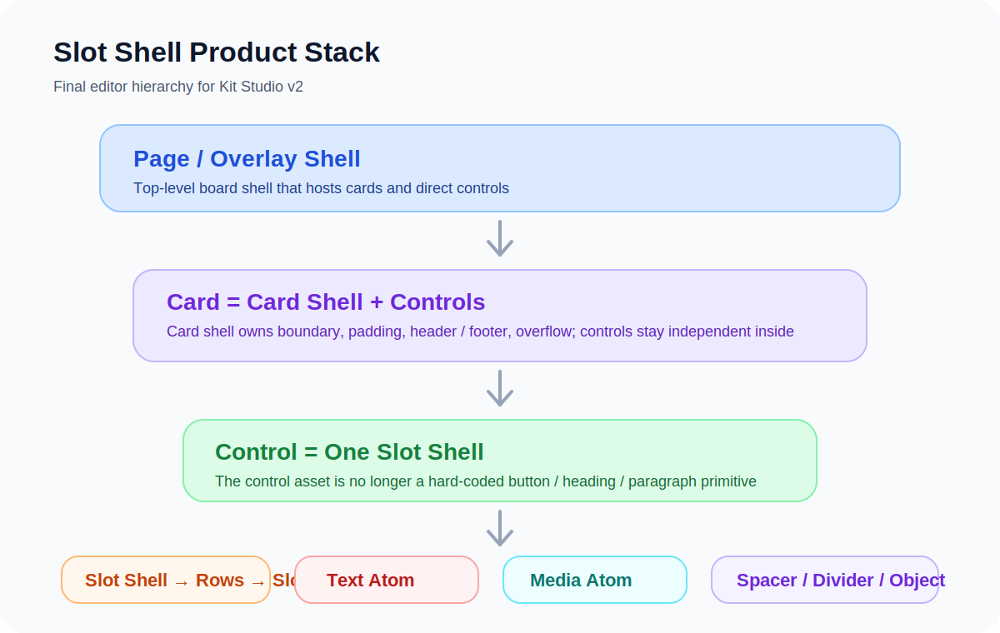
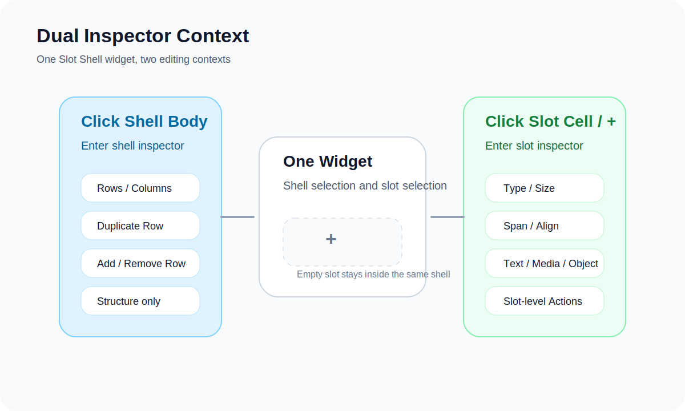
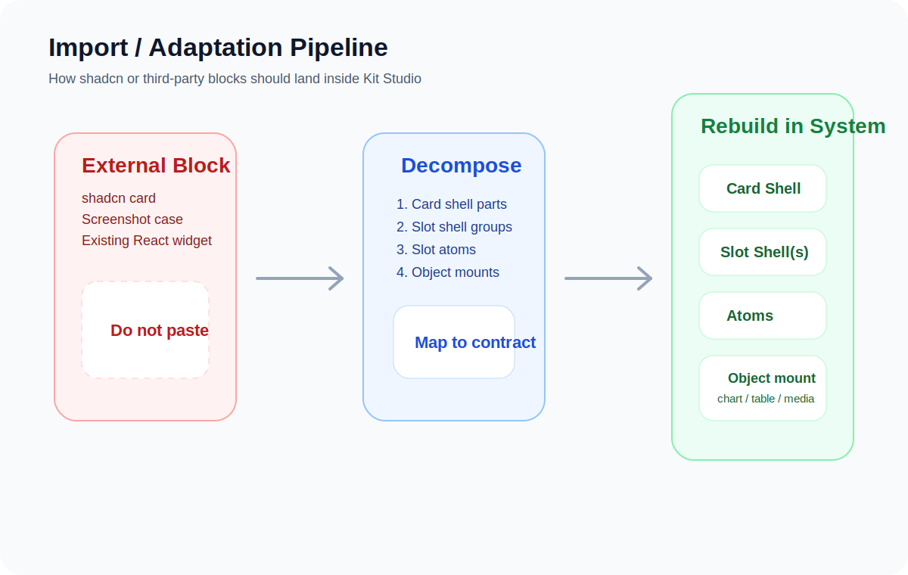

# Slot Shell Product Architecture

本文件是 `Kit Studio` 当前这轮底层重构的正式定稿说明。

目标不是描述某一个现成控件，而是把后续所有常规控件、导入组件、卡片拆解、属性面板设计，都统一到一套产品化底层上。







## 1. 定位

当前版本的核心结论：

- `Atom` 才是最小原子，但它不直接出现在左侧拖拽栏
- `Slot` 是承载原子的格子
- `Slot Shell` 是唯一需要长期扩展的基础 control 母体
- `Control = 1 个 Slot Shell`
- `Card = Card Shell + 多个 controls`
- `Page / Overlay = 顶层 shell + card / control`

这意味着：

- 不再继续把 `heading / paragraph / button` 视为系统级基础控件
- 这些常见控件以后都应该被视为 `Slot Shell` 的组合结果或预设

## 2. 名词对齐

### 2.1 Atom

当前先定义 5 类原子能力：

- `text`
- `media`
- `spacer`
- `divider`
- `object`

说明：

- `text`：文本原子
- `media`：图标 / 图片 / 视频入口
- `spacer`：占位与节奏控制
- `divider`：结构分隔
- `object`：图表、表格、媒体挂载、后续复杂对象

### 2.2 Slot

`Slot` 是一个格子。

它负责：

- 承载一个原子
- 定义自己的 `type / size / span / align`
- 挂自己的 `actions`

### 2.3 Slot Shell

`Slot Shell` 是一个结构壳。

它负责：

- 行列结构
- 行复制
- 拼接 / 拆分 slot
- 管理内部 slot 阵列

它不负责：

- 像普通控件那样自由缩放
- 直接承担 card shell 的边界职责

## 3. 编辑器合同

### 3.1 左栏暴露

在 `canvas / kits` 场景里，当前核心 control 入口只保留：

- `Slot Shell`

其他历史控件可以继续兼容已有数据，但不再是底层推荐入口。

### 3.2 默认落地形态

`Slot Shell` 拖到画布上后：

- 默认是 `1 x 1`
- 默认是空 slot
- 默认视觉是虚线格子 + 中间 `+`
- 不再显示普通控件式的 root resize

### 3.3 双态右侧栏

这是这一版最重要的产品规则。

#### 点击 Slot Shell 本体

进入 shell 自己的面板，只处理结构：

- `Rows`
- `Columns`
- `Duplicate Row`
- `Add / Remove Row`

#### 点击某个 slot 或 `+`

进入 slot 面板，只处理该 slot 自己的属性：

- `Type`
- `Size`
- `Span`
- `Align`
- `Text / Media / Object`
- `Actions`

不能再把所有 slot 全摊在一个 inspector 里。

## 4. 当前数据合同

```ts
type SlotShellSlotType = 'empty' | 'text' | 'media' | 'spacer' | 'divider' | 'object'
type SlotShellSlotSize = 'sm' | 'md' | 'lg'
type SlotShellSlotAlign = 'start' | 'center' | 'end'

type SlotShellSlot = {
  id: string
  type: SlotShellSlotType
  span: number
  size: SlotShellSlotSize
  align: SlotShellSlotAlign
  hoverText?: string

  text?: string
  textRole?: 'title' | 'body' | 'meta'

  mediaKind?: 'icon' | 'image' | 'video'
  icon?: IconName
  imageUrl?: string
  videoUrl?: string

  objectKind?: 'chart' | 'table' | 'calendar' | 'media' | 'custom'
  objectLabel?: string

  actions?: NodeAction[]
}

type SlotShellRow = {
  id: string
  slots: SlotShellSlot[]
}

type SlotShellContract = {
  rowCount: number
  columnCount: number
  rows: SlotShellRow[]
}
```

## 5. 布局与尺寸规则

- `Slot Shell` 不暴露传统 `size inspector`
- 编辑器底层仍会把它映射到 grid `w / h`
- 但这个尺寸不是用户直接调的，而是根据 `rowCount / columnCount / rows` 自动推导
- `slot` 的高度由该 slot 的 `size` 决定
- 行高度取该行内部最高 slot

这套做法是为了兼容当前 board / nested canvas 机制，同时又保持产品层面的“结构壳”语义。

## 6. 导入组件时的拆解规则

以后无论是：

- `shadcn`
- 现成 React 控件
- 截图逆向
- 历史卡片模板

都不应该直接贴一个“成品控件”进系统。

统一流程：

1. 先判断有没有 card shell
2. 拆出内部几个 slot shell
3. 再拆每个 slot
4. 把内容还原为 `text / media / spacer / divider / object`
5. 把真正复杂的能力挂到 `object`

## 7. 当前代码落点

当前这轮重构的主要文件：

- `src/builder/slotShell.ts`
- `src/components/patterns/SlotShellWidgets.tsx`
- `src/components/builder-page/SlotShellInspectorSections.tsx`
- `src/components/builder-page/WidgetInspectorPanel.tsx`
- `src/builder/WidgetWrapper.tsx`
- `src/store/builderStore.ts`
- `src/pages/BuilderPage.tsx`

## 8. 后续开发顺序

建议下一步按下面顺序推进：

1. 用 `Slot Shell` 手造第一批高频控件预设
2. 给 `object` 补真实挂载协议
3. 把导入适配服务模块化
4. 再扩展用户级“导入并适配”能力

## 9. 与旧版文档关系

当前文件是产品化第二版定稿说明。

配套补充：

- `docs/slot-shell-contract.md`
- `docs/control-system-p0-p4.md`

如果后面再演进，优先在本文件上继续叠代，而不是重新回到“场景化控件堆砌”的路线。
